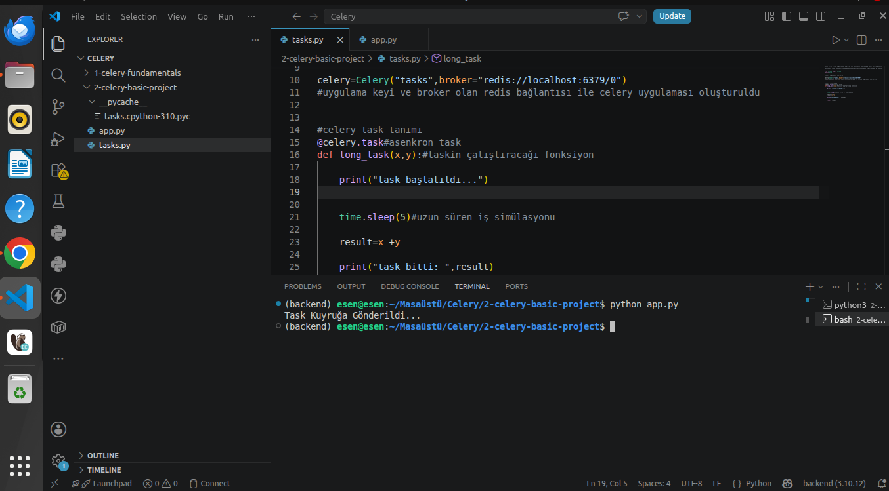
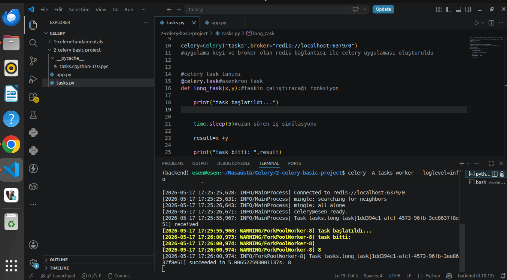
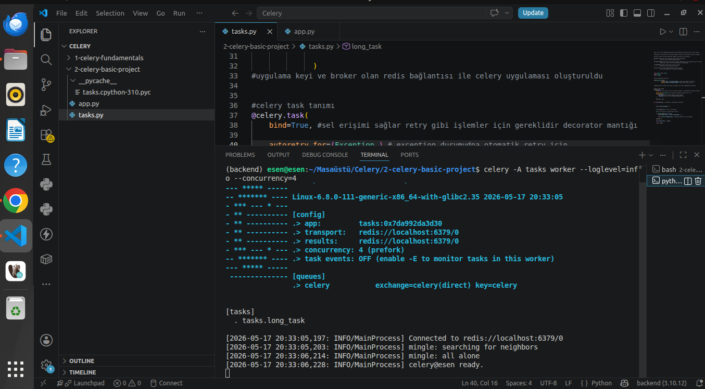
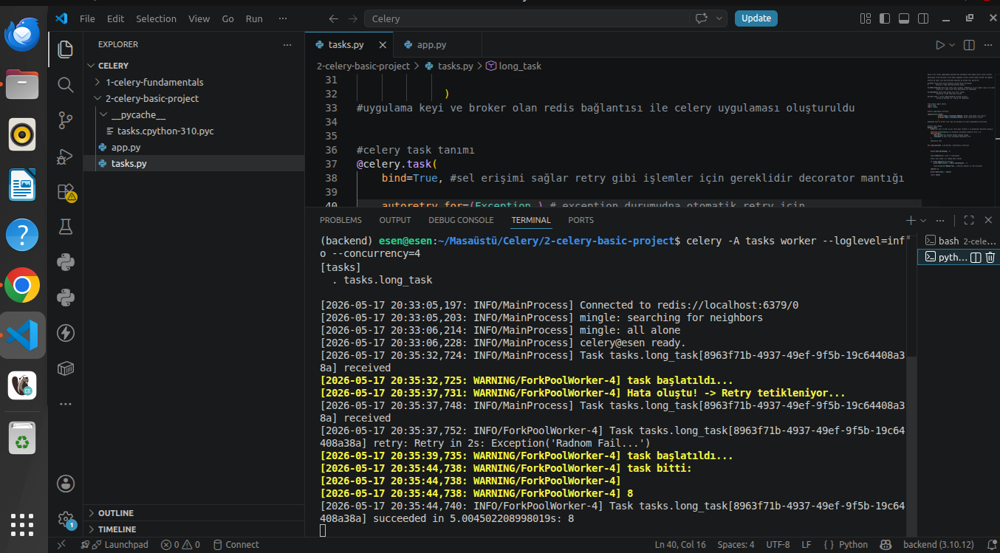

# Celery Basic Project

- Bu proje Celery’nin temel çalışma mantığını anlamak ve pratik etmek amacıyla hazırlanmıştır  
- Amaç, uzun süren işlemleri ana uygulamadan ayırarak arka planda çalışan worker process’ler ile yönetmektir  
- Uygulama doğrudan işlem yapmaz, task oluşturur ve Redis üzerinden kuyruğa gönderir  
- Celery worker bu task’ları alır ve arka planda çalıştırır  
- Böylece sistem bloklanmaz, performans ve ölçeklenebilirlik sağlanır  
- Bu proje, Celery’nin hazır sunduğu mekanizmaların tek bir mini proje üzerinde pratik edildiği bir çalışmadır  

---

## Projenin Mantığı ve Yapılanlar

- app.py üzerinden task oluşturulup Redis kuyruğuna gönderilmiştir  
- Redis task queue olarak kullanılmıştır  
- Celery worker kuyruğu dinleyerek task’ları alıp çalıştırmıştır  
- Task sonucu ve durum bilgisi Redis backend üzerinden takip edilmiştir  

---

## Pratik Edilen Celery Özellikleri

- Task Queue  
  - İşler doğrudan çalıştırılmamış, kuyruğa gönderilmiştir  
  - delay() ile uygulanmıştır  

- Worker Process  
  - Kuyruktaki işleri alıp çalıştıran yapı kullanılmıştır  
  - celery worker komutu ile başlatılmıştır  

- Retry (Tekrar Deneme)  
  - Task hata aldığında otomatik tekrar çalıştırılmıştır  
  - autoretry_for ve retry_kwargs ile tanımlanmıştır  

- Error Handling (Hata Yönetimi)  
  - Task hata verdiğinde sistem çökmeden Celery tarafından yönetilmiştir  
  - Exception fırlatılarak Celery’nin yakalaması sağlanmıştır  

- Concurrency (Paralel Çalışma)  
  - Aynı anda birden fazla task çalıştırılmıştır  
  - worker başlatılırken --concurrency parametresi ile yapılmıştır  

- Timeout  
  - Task belirli süreyi aşarsa durdurulacak şekilde yapılandırılmıştır  
  - time_limit ile tanımlanmıştır  

- Task State (Durum Takibi)  
  - Task’ın PENDING, STARTED, RETRY, SUCCESS durumları gözlemlenmiştir  
  - result.status ile takip edilmiştir  

---

## Redis

- Bu projede Redis hali hazırda çalıştığı için tekrar başlatılmamıştır  
- Eğer Redis çalışmıyorsa aşağıdaki komut ile başlatılabilir  

docker run -d -p 6379:6379 redis

---

## Celery Worker Başlatma

- İlk olarak Celery worker aşağıdaki komut ile başlatılmıştır  

celery -A tasks worker --loglevel=info

- Task gönderildiğinde uygulama tarafında kuyruğa gönderildiği gözlemlenmiştir  

Görsel:  

---

## Task İşlenmesi

- python app.py çalıştırılarak task gönderilmiştir  
- Worker tarafında task’ın alındığı ve çalıştırıldığı görülmüştür  

Görsel:  

---

## Concurrency (Paralel Çalışma)

- Celery worker aşağıdaki komut ile paralel çalışacak şekilde başlatılmıştır  

celery -A tasks worker --loglevel=info --concurrency=4

- Aynı anda birden fazla task’ın çalıştığı gözlemlenmiştir  

Görsel:  

---

## Task State Takibi

- python app.py çalıştırıldığında task’ın durum bilgisi gözlemlenmiştir  
- PENDING, STARTED gibi state değişimleri takip edilmiştir  

Görsel:  

---

## Retry ve Log Kayıtları

- Task sırasında oluşan hatalar sonucunda Celery’nin retry mekanizması devreye girmiştir  
- Worker loglarında retry süreci ve tekrar çalıştırma adımları gözlemlenmiştir  

Görsel:  
screenshots/5-celery-task-retry.png

---

