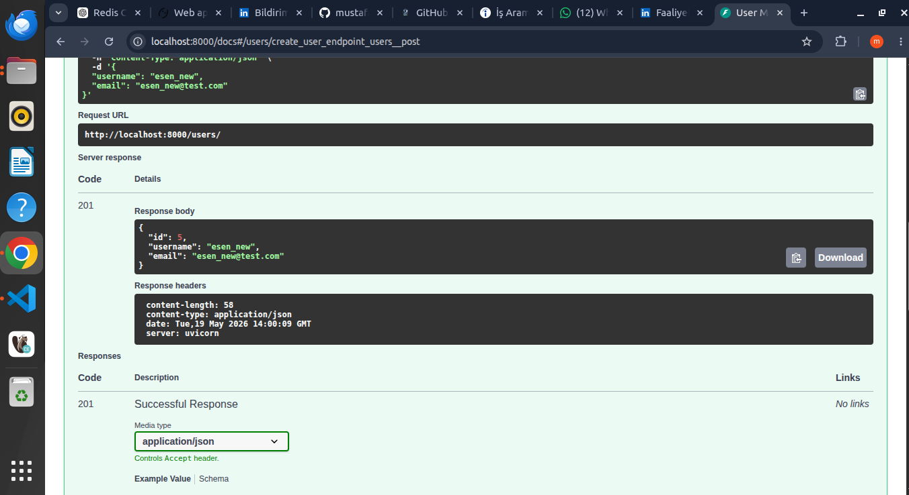
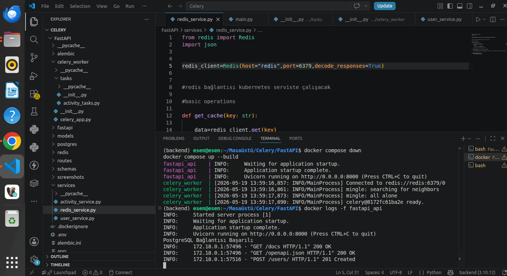
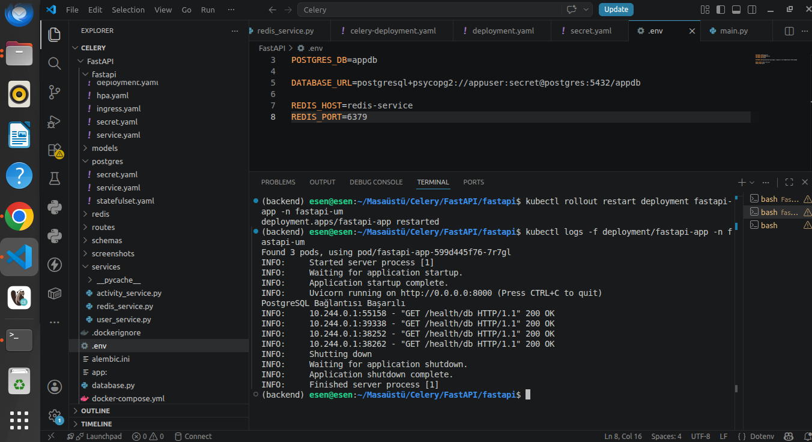
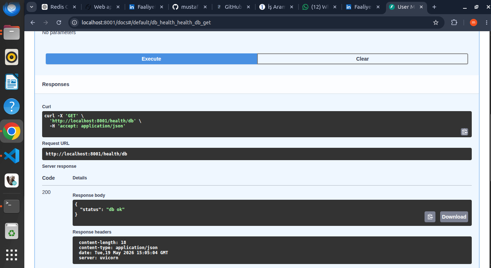
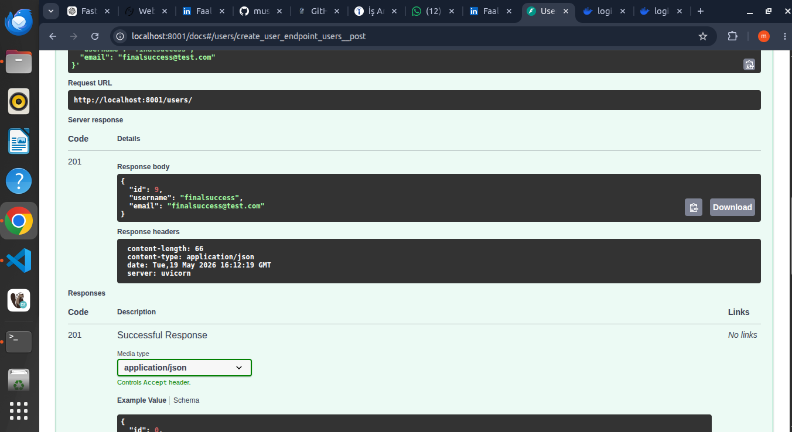
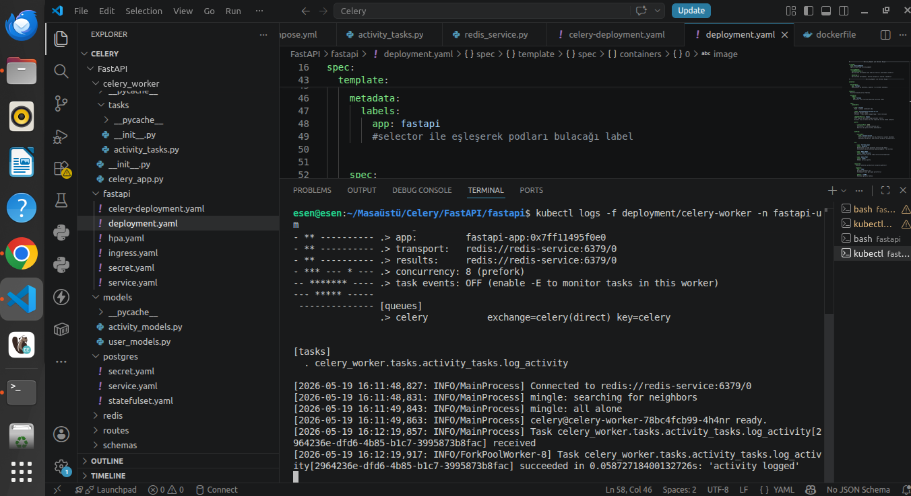

# Celery Integration (FastAPI + Redis + Kubernetes)

Bu aşamada FastAPI projesine Celery entegrasyonu yapılarak activity log işlemleri ana request akışından ayrıldı ve background task mimarisine geçirildi.

Önceden kullanıcı oluşturulduğunda activity log kayıtları doğrudan API request’i içinde PostgreSQL’e yazılıyordu. Bu yaklaşım küçük projelerde çalışsa da production ortamlarında request süresini uzatır ve API performansını düşürür.

Bu yüzden Celery + Redis kullanılarak asynchronous task mimarisi kuruldu.

Amaç:

- API request’ini hızlı döndürmek
- Ağır veya ekstra işlemleri background worker’a bırakmak
- FastAPI ile worker katmanını ayırmak
- Gerçek production mimarisine yaklaşmak

---

# Yapılan Mimari

Kurulan yapı:

FastAPI → Redis Queue → Celery Worker → PostgreSQL

Akış şu şekilde ilerliyor:

1. Kullanıcı API üzerinden oluşturulur
2. FastAPI kullanıcıyı DB’ye kaydeder
3. Activity log işlemini direkt yapmak yerine queue’ya task bırakır
4. Redis broker olarak görevi taşır
5. Celery Worker görevi alır
6. Worker activity kaydını PostgreSQL’e yazar

Bu sayede request thread’i activity insert işlemini beklemez.

---

# Celery Yapısı

Proje içinde `celery_worker` klasörü oluşturuldu.

Bu klasör altında:

- `celery_app.py`
- `tasks/activity_tasks.py`

dosyaları yazıldı.

`celery_app.py` içinde:

- Celery uygulaması oluşturuldu
- Redis broker bağlantısı tanımlandı
- Redis backend tanımlandı
- Task discovery/import işlemleri yapıldı

`activity_tasks.py` içinde:

- Activity log işlemi Celery task olarak tanımlandı
- Worker için ayrı database session açıldı
- PostgreSQL insert işlemi burada gerçekleştirildi

---

# Service Katmanının Güncellenmesi

Önceden activity kayıtları service içinde synchronous şekilde yazılıyordu.

Bu yapı değiştirildi.

Artık kullanıcı oluşturulduğunda:

- Activity log işlemi direkt DB’ye yazılmıyor
- Celery task queue’ya gönderiliyor

Bu aşamada:

- `user_service.py`
- `redis_service.py`

taraflarında güncellemeler yapıldı.

Ayrıca Redis host bilgileri Kubernetes service adına göre güncellendi.

---

# Kubernetes Tarafı

Celery için ayrı bir deployment oluşturuldu.

`celery-deployment.yaml`

dosyası ile:

- Celery worker pod’u ayağa kaldırıldı
- Redis broker bağlantısı tanımlandı
- PostgreSQL bağlantısı tanımlandı

FastAPI deployment tarafında da:

- Redis env değişkenleri eklendi
- Yeni image tag’leri kullanıldı
- Rolling update ile rollout yapıldı

---

# Süreçte Karşılaşılan Gerçek Problemler

Bu aşamada production ortamlarında çok sık görülen problemler yaşandı ve çözüldü.

Karşılaşılan problemler:

- Namespace mismatch
- ImagePullBackOff
- Docker image tag hataları
- Redis DNS/service name problemi
- Celery import problemi
- Docker build context problemi
- Missing migration
- SQLAlchemy foreign key metadata problemi
- Redis connection problemi
- Background task routing problemleri

Bu sorunlar çözülerek Celery mimarisi stabil hale getirildi.

---

# Build & Push Süreci

Kod güncellemelerinden sonra image yeniden build edilip Docker Hub’a push edildi.

Kullanılan temel komutlar:

```bash
docker build -t mustafaaeesen/fastapi-um:2.5 .
```

```bash
docker push mustafaaeesen/fastapi-um:2.5
```

---

# Kubernetes Güncelleme Süreci

Deployment dosyaları güncellendikten sonra:

```bash
kubectl apply -f deployment.yaml -n fastapi-um
```

```bash
kubectl apply -f celery-deployment.yaml -n fastapi-um
```

Rollout restart işlemleri yapıldı:

```bash
kubectl rollout restart deployment fastapi-app -n fastapi-um
```

```bash
kubectl rollout restart deployment celery-worker -n fastapi-um
```

Pod durumları kontrol edildi:

```bash
kubectl get pods -n fastapi-um
```

Celery logları takip edildi:

```bash
kubectl logs -f deployment/celery-worker -n fastapi-um
```

---

# Final Sonuç

Final aşamasında Celery worker task’i başarıyla aldı ve PostgreSQL activity log kaydını background şekilde gerçekleştirdi.

Log çıktısında:

- Task received
- Task succeeded

mesajları görüldü.

Bu aşamayla birlikte proje artık:

- FastAPI
- PostgreSQL
- Redis
- Celery
- Kubernetes

kullanan gerçek bir asynchronous backend mimarisine geçmiş oldu.

---

# Screenshots












